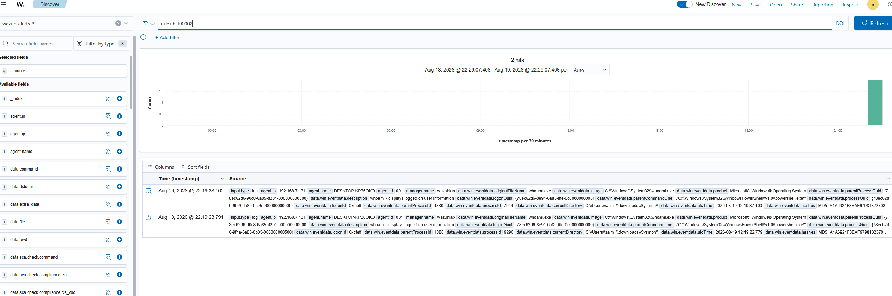

# Building a Virtualized SOC Lab & Custom Detection Engineering (Wazuh SIEM)

## Executive Summary
This project demonstrates the end-to-end deployment of a 3-tier Security Operations Center (SOC) home lab. The environment ingests telemetry from a Windows 10 target endpoint running Sysmon into a centralized Wazuh SIEM Manager. Adversary attacks were executed using Kali Linux to generate real-world telemetry, write custom XML detection rules mapped to the MITRE ATT&CK framework, and document incident response playbooks.

## Lab Architecture & Topology


* **Manager / SIEM:** Wazuh Manager 4.8 on Ubuntu 22.04 LTS (IP: 192.168.7.130)
* **Target Endpoint:** Windows 10 Enterprise with Sysmon v15 (IP: 192.168.7.131)
* **Attacker Machine:** Kali Linux (IP: 192.168.7.132)
* **Network Mode:** VMware NAT Subnet (192.168.7.0/24)

---## Phase 2: Telemetry & Ingestion Verification

Before engineering custom rules, end-to-end log ingestion was verified to ensure the Wazuh Agent on the Windows 10 target (`192.168.7.131`) was actively forwarding Sysmon operational logs to the manager over TCP port `1514`.

### 1. Sysmon Event Channel Configuration
The Wazuh Agent `ossec.conf` on the target machine was configured to monitor the native Sysmon channel:

```xml
<localfile>
  <location>Microsoft-Windows-Sysmon/Operational</location>
  <log_format>eventchannel</log_format>
</localfile>
```
### 2. Live Telemetry Stream Proof

Querying the wazuh-alerts-* index in the Wazuh Dashboard confirmed successful ingestion of Sysmon Event ID 1 (Process Creation) logs.



* **Source Host:** DESKTOP-KP36OKO (192.168.7.131) via Agent ID 001
* **Captured Metadata:** Includes image file paths, parent-child process execution trees, system user context, and SHA256 file hashes.
* **Pipeline Status:** Verified live ingestion, confirming the telemetry pipeline was ready for rule development.

## Detection Scenario 1: Command Line Reconnaissance (`whoami`)

### 1. Attack Execution (Kali / Windows Target)
* **MITRE ATT&CK Technique:** T1033 - System Owner/User Discovery
* **Description:** Executed local user discovery via command prompt to test endpoint visibility.
* **Command:**
  ```cmd
  whoami.exe /all

  
