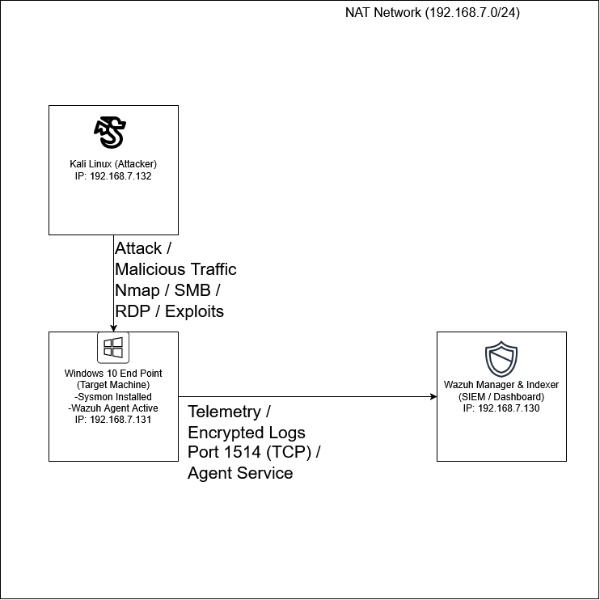
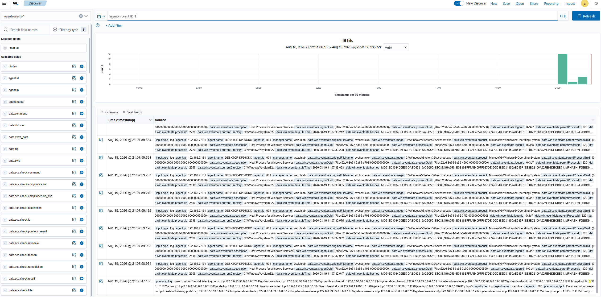
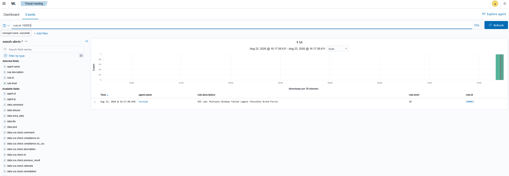

# Building a Virtualized SOC Lab & Custom Detection Engineering (Wazuh SIEM)

## Executive Summary
This project demonstrates the end-to-end deployment of a 3-tier Security Operations Center (SOC) home lab. The environment ingests telemetry from a Windows 10 target endpoint running Sysmon into a centralized Wazuh SIEM Manager. Adversary attacks were executed using Kali Linux to generate real-world telemetry, write custom XML detection rules mapped to the MITRE ATT&CK framework, and document incident response playbooks.

## Lab Architecture & Topology


* **Manager / SIEM:** Wazuh Manager 4.8 on Ubuntu 22.04 LTS (IP: 192.168.7.130)
* **Target Endpoint:** Windows 10 Enterprise with Sysmon v15 (IP: 192.168.7.131)
* **Attacker Machine:** Kali Linux (IP: 192.168.7.132)
* **Network Mode:** VMware NAT Subnet (192.168.7.0/24)

---## Phase 2: Telemetry & Ingestion Verification

Before engineering custom rules, end-to-end log ingestion was verified to ensure the Wazuh Agent on the Windows 10 target (`192.168.7.131`) was actively forwarding Sysmon operational logs to the manager over TCP port `1514`.

### 1. Sysmon Event Channel Configuration
The Wazuh Agent `ossec.conf` on the target machine was configured to monitor the native Sysmon channel:

```xml
<localfile>
  <location>Microsoft-Windows-Sysmon/Operational</location>
  <log_format>eventchannel</log_format>
</localfile>
```
### 2. Live Telemetry Stream Proof

Querying the wazuh-alerts-* index in the Wazuh Dashboard confirmed successful ingestion of Sysmon Event ID 1 (Process Creation) logs.



* **Source Host:** DESKTOP-KP36OKO (192.168.7.131) via Agent ID 001
* **Captured Metadata:** Includes image file paths, parent-child process execution trees, system user context, and SHA256 file hashes.
* **Pipeline Status:** Verified live ingestion, confirming the telemetry pipeline was ready for rule development.

## Detection Scenario 1: Command Line Reconnaissance (`whoami`)

### 1. Attack Execution (Kali / Windows Target)
* **MITRE ATT&CK Technique:** T1033 - System Owner/User Discovery
* **Description:** Executed local user discovery via command prompt to test endpoint visibility.
**Command:**
```cmd
whoami.exe /all
```

### 2. Custom Detection Rule Engineering
To flag this reconnaissance activity, custom detection logic was implemented in `/var/ossec/etc/rules/local_rules.xml` on the Wazuh Manager to match Sysmon Event ID 1 process creation for `whoami.exe`:

```xml
<group name="sysmon,custom_rules,">
  <rule id="100002" level="8">
    <if_sid>61603</if_sid> <!-- Sysmon Event ID 1 -->
    <field name="win.eventdata.originalFileName">whoami.exe</field>
    <description>SOC Lab: Reconnaissance Activity - whoami execution detected</description>
    <mitre>
      <id>T1033</id>
    </mitre>
  </rule>
</group>  
```
### 3. Alert Verification & Dashboard Evidence
After restarting the wazuh-manager service, running whoami /all on the target endpoint generated an immediate Level 8 Alert in the Wazuh Dashboard.

* **Triggered Rule ID: 100002

* **Alert Level: 8 (High Severity Reconnaissance)

* **Parent Process: powershell.exe (PID: 1880)

* **Target Path: C:\Windows\System32\whoami.exe

### 4. SOC Analyst Response Playbook

* **Triage & Investigation: Verify the parent process spawning whoami.exe. If launched by an administrator in an interactive terminal, mark as benign activity. If spawned by a web server process (w3wp.exe), script runner, or unknown service, escalate immediately.

* **Containment: If unauthorized, isolate the target host directly via the Wazuh Manager agent control to prevent lateral movement.

* **Remediation: Inspect active parent process trees, terminate suspicious execution threads, and audit endpoint user accounts.

---

## Detection Scenario 2: Network Authentication Brute-Force (Ncrack/Hydra -> Windows)

### 1. Attack Execution (Kali Linux)
* **MITRE ATT&CK Technique:** T1110 - Brute Force
* **Description:** Executed automated NTLM credential validation attempts against SMB on the target endpoint using Python and Impacket to simulate rapid network authentication failure.
**Command:**
```bash
python3 -c '
from impacket.smbconnection import SMBConnection
target = "192.168.7.131"
for i in range(5):
    try:
        conn = SMBConnection(target, target, timeout=2)
        conn.login(f"user{i}", f"wrongpass{i}")
    except: pass
'```

### 2. Custom Detection Rule Engineering

Implemented a custom correlation threshold rule in /var/ossec/etc/rules/local_rules.xml to aggregate rapid Windows Event ID 4625 (Failed Logon) telemetry within a strict timeframe:

```<group name="windows,authentication_failed,">
  <rule id="100003" level="10" frequency="3" timeframe="60">
    <if_matched_sid>60122</if_matched_sid> <!-- Windows Event ID 4625: Logon Failure -->
    <description>SOC Lab: Multiple Windows Failed Logons (Possible Brute-Force)</description>
    <mitre>
      <id>T1110</id>
    </mitre>
  </rule>
</group>
```
### 3. Alert Verification & Dashboard Evidence

The attack threshold was met within 60 seconds, triggering an immediate Level 10 (High Severity) correlation alert in the Wazuh SIEM dashboard.



* **Triggered Rule ID: 100003

* **Alert Level: 10 (High Severity Authentication Attack)

* **Target Host: DESKTOP-KP360KO (192.168.7.131)

* **Attacker IP: 192.168.7.132 (Kali Linux)


### 4. SOC Analyst Response Playbook

** *Triage & Investigation: Inspect raw JSON logs to verify target username and confirm the source IP (192.168.7.132). Cross-reference time window for any subsequent successful logons (Event ID 4624) from the same source IP indicating a breached account.

** *Containment: Temporarily isolate the victim host via Wazuh agent controls or block traffic from the attacking IP address using host firewalls or Active Response.

** *Remediation: Enforce strong password complexity, implement Group Policy account lockout thresholds, and restrict open internal SMB/RDP ports behind network segmentation.
---

## Active Response Scenario: Automated Threat Containment

### 1. Active Response Workflow
* **Trigger Event:** High-Frequency Authentication Failure Threshold (Rule `100003`)
* **Response Action:** Dynamic IP Containment via Windows Firewall (`netsh.exe`)
* **Block Duration:** 10-Minute Dynamic Block (`timeout: 600s`)

### 2. Active Response Configuration (`/var/ossec/etc/ossec.conf`)
```xml
<command>
  <name>netsh</name>
  <executable>netsh.exe</executable>
  <expect>srcip</expect>
  <timeout_allowed>yes</timeout_allowed>
</command>

<active-response>
  <command>netsh</command>
  <location>local</location>
  <rules_id>100003</rules_id>
  <timeout>600</timeout>
</active-response>
```

### 3. Active Response Workflow
Upon detecting rapid credential brute-force attempts from Kali Linux (192.168.7.132), the Wazuh Manager issued an automated Active Response command to the Windows agent. The agent executed netsh.exe to inject a dynamic inbound drop rule into Windows Firewall.

* **Target Host: DESKTOP-KP360KO (192.168.7.131)

* **Contained Attacker IP: 192.168.7.132 (100% ICMP Packet Loss Verified)

* **Result: Attack vector neutralized automatically without requiring manual SOC operator intervention, drastically lowering Mean Time to Respond (MTTR).

### Section Structure Overview
* **`## Detection Scenario 1`** (Manual Lock-screen Attempts)
* **`## Detection Scenario 2`** (Network SMB Brute-Force)
* **`## Active Response Scenario`** (Automated Firewall Containment)
